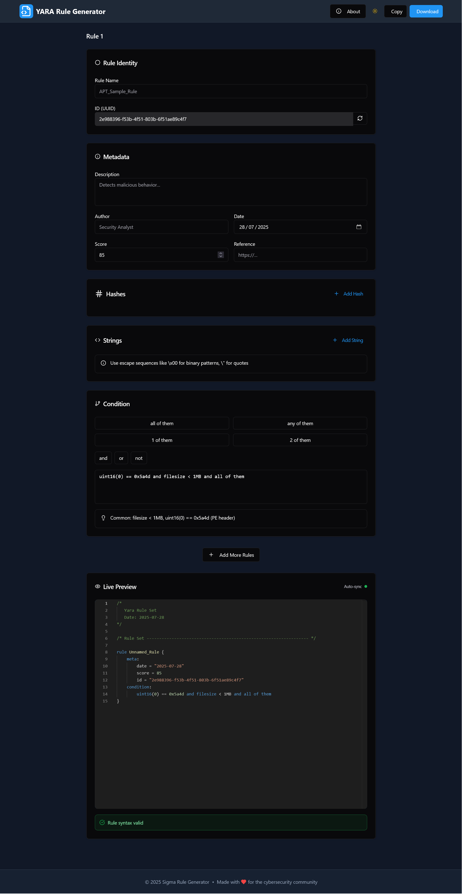
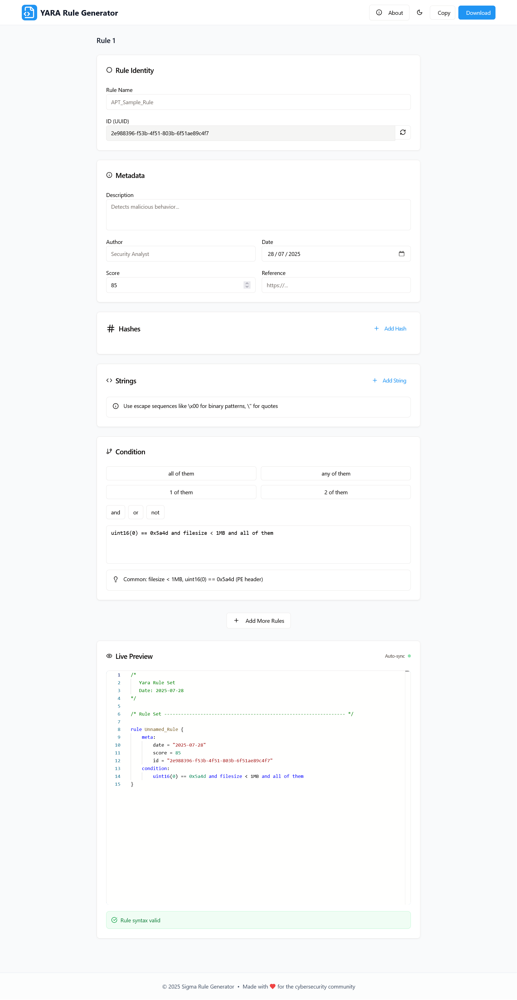
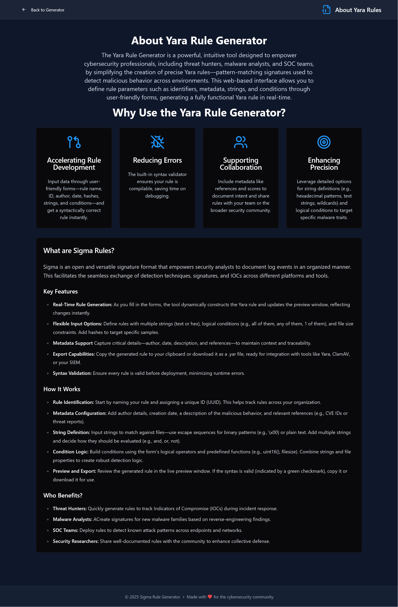

# Yara Rule Generator - YARA Rule Generator: A Simple Guide

## Welcome to Yara Rule Generator!
Yara Rule Generator is your go-to tool for creating YARA rules without the hassle. Whether you're new to cybersecurity or an experienced analyst, this web app makes it easy to build rules to spot malware, suspicious files, or threats in your system. Just fill out a few simple forms, and Yara Rule Generator does the heavy lifting, generating ready-to-use rules you can copy or download instantly. It’s like having a helpful assistant for your security work!

## What Does Yara Rule Generator Do?
Think of Yara Rule Generator as a user-friendly wizard for making YARA rules—special instructions that help computers identify bad files or behavior. You don’t need to be a coding expert. The tool guides you through adding details like what to look for (e.g., specific text or code patterns), who created the rule, and when. Once you’re done, it shows you the rule in real-time and lets you save it with a click. It’s designed to save you time and keep your security efforts on track.

## How It Works
1. **Fill Out Forms**: Enter basic info like a rule name, description, or patterns to detect.
2. **See It Live**: As you type, the rule builds itself in a preview window.
3. **Grab Your Rule**: Copy it to your clipboard or download it as a file to use right away.
4. **Switch Themes**: Choose light or dark mode to suit your preference.

## Who Can Use It?
- **Beginners**: Learn to create rules step-by-step with no coding needed.
- **Analysts**: Quickly build rules for spotting malware or threats.
- **Teams**: Share rules with colleagues to strengthen your security.

## Why It’s Helpful
Yara Rule Generator takes the guesswork out of writing YARA rules. Instead of typing complex code, you just pick options and fill in blanks. It checks your work to avoid mistakes and lets you export rules to use with tools you already have. Plus, it looks great and works smoothly, whether you like a light or dark screen.

## Getting Started
No setup required—just open Yara Rule Generator in your browser. Start by adding a rule name and some details, and watch it come to life. If you’re new, try matching a simple word like “malware” to see how it works. The tool will guide you!

## A Quick Look

- **Dark Theme**: 

- **Light Theme**: 

- **About Page**: 

Yara Rule Generator is built with love by people who care about cybersecurity, making it a handy tool for keeping your systems safe. Give it a try and see how easy security can be!